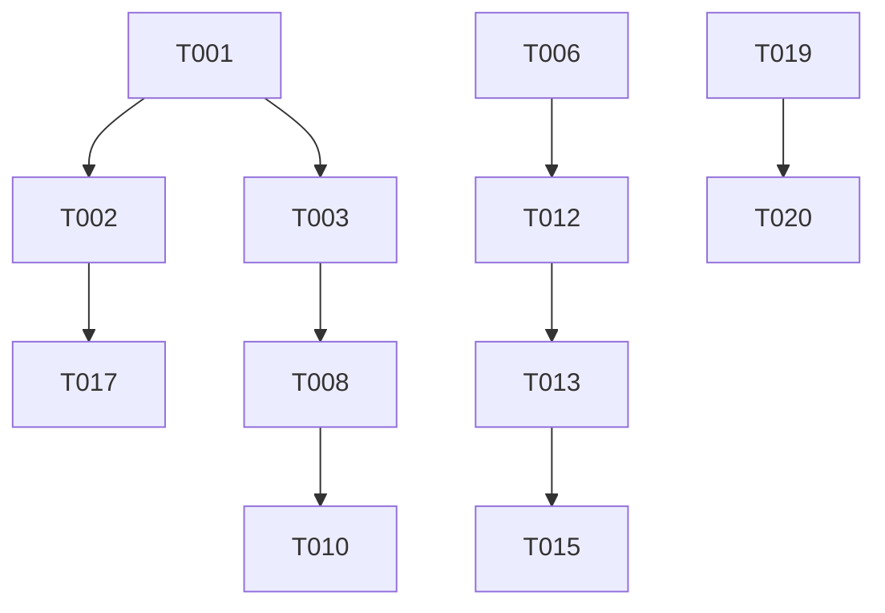

# Tasks: Complete Banking System Fix & BRD Coverage

**Feature**: [Complete Banking System Fix & BRD Coverage](/specs/002-context-existing-next/spec.md)
**Plan**: [Implementation Plan](/specs/002-context-existing-next/plan.md)
**Branch**: `002-context-existing-next`

## Implementation Strategy

We will follow an incremental delivery approach, starting with the foundational i18n and routing infrastructure before implementing specific BRD-mandated product pages and compliance modules.

- **Phase 1 & 2**: Establish the core multilingual and routing infrastructure.
- **Phase 3 (US1)**: Fix navigation and implement the flat root-level slug structure with redirects.
- **Phase 4 (US2)**: Complete the English/Hindi translation system for all product content.
- **Phase 5 (US3)**: Implement regulatory compliance modules (DEAF, Grievance, KFS).
- **Phase 6**: Final polish and validation.

## Phase 1: Setup

- [X] T001 Initialize the project structure and shared library paths in `lib/`
- [X] T002 [P] Configure Prisma schema for Product, Inquiry, and DEAF entities in `prisma/schema.prisma`
- [X] T003 [P] Set up i18n configuration using `next-intl` or custom middleware in `middleware.ts`

## Phase 2: Foundational

- [X] T004 Implement the Accessibility Context and Toolbar component in `components/layout/accessibility-toolbar.tsx`
- [X] T005 [P] Create the EMI calculation utility in `lib/calculations.ts`
- [X] T006 Implement the shared Product Page Shell (Hero + Tabs) in `components/banking/ProductPageShell.tsx`
- [X] T007 [P] Implement the Inline Inquiry Form component in `components/forms/InquiryForm.tsx`

## Phase 3: Fix All Navigation (User Story 1)

**Goal**: Zero broken links and flat root-level slug structure.

- [X] T008 [US1] Configure 301 redirects in `next.config.ts` for all legacy nested paths
- [X] T009 [P] [US1] Implement the internal Net Banking page at `app/digital-services/net-banking/page.tsx`
- [X] T010 [US1] Update `components/layout/header.tsx` to use the new root-level slugs and `/net-banking` page
- [X] T011 [P] [US1] Update `components/layout/footer.tsx` with complete BRD-mandated link list
- [X] T012 [US1] Promote existing product pages (e.g., `home-loan`) to the root of the `app/` directory

## Phase 4: Multilingual Experience (User Story 2)

**Goal**: 100% EN/HI coverage for all UI and product content.

- [X] T013 [US2] Generate AI-based Hindi translations for all product content in `locales/hi.json`
- [X] T014 [P] [US2] Implement the language toggle component in `components/layout/Navigation.tsx`
- [X] T015 [US2] Update all UI components (Header, Footer, ProductShell) to use localized strings via `i18n.ts`
- [X] T016 [P] [US2] Ensure form validation messages in `InquiryForm.tsx` are localized

## Phase 5: Regulatory Compliance (User Story 3)

**Goal**: Full compliance with DEAF, Grievance, and KFS requirements.

- [X] T017 [US3] Implement the DEAF Search Table and real-time filtering in `app/compliance/deaf-unclaimed-deposits/page.tsx`
- [X] T018 [P] [US3] Create the Grievance Escalation Matrix component in `components/compliance/EscalationMatrix.tsx`
- [X] T019 [US3] Implement the KFS (Key Facts Statement) panel in `components/banking/KFSPanel.tsx`
- [X] T020 [P] [US3] Integrate KFSPanel into all 18 loan product pages
- [X] T021 [US3] Create the Policy Centre page with downloadable PDF links in `app/compliance/policy-centre/page.tsx`

## Phase 6: Polish & Cross-Cutting

- [X] T022 [P] Audit all pages for WCAG 2.1 AA compliance and fix semantic HTML issues
- [X] T023 Finalize responsive styling (spacing, typography) across all 100+ pages
- [X] T024 [P] Implement SEO metadata (titles, descriptions) for all root-level slugs
- [X] T025 Conduct final BRD coverage validation and link checking

## Dependency Graph

## Parallel Execution Examples

### Within US1 (Phase 3)
- T009 (Net Banking page) and T011 (Footer update) can be done in parallel.

### Within US3 (Phase 5)
- T017 (DEAF Table) and T018 (Grievance Matrix) can be done in parallel as they touch different compliance subpages.
